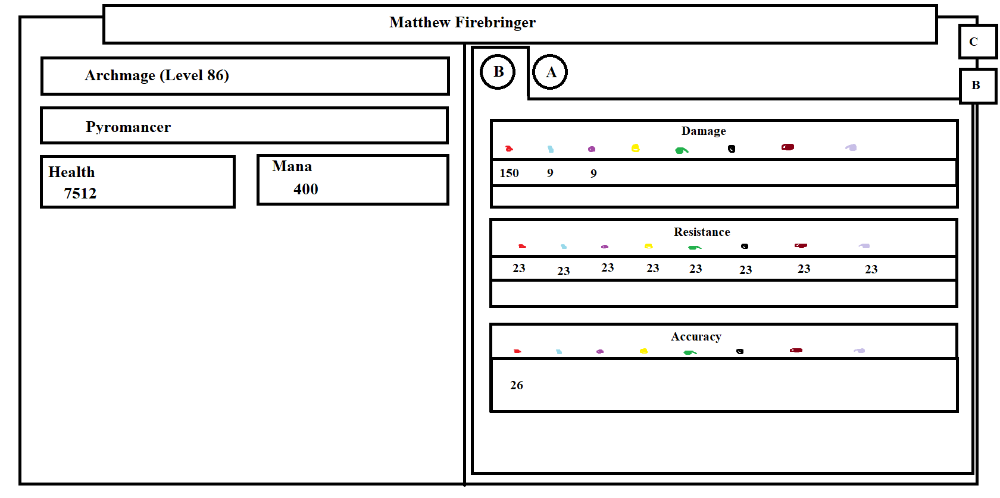
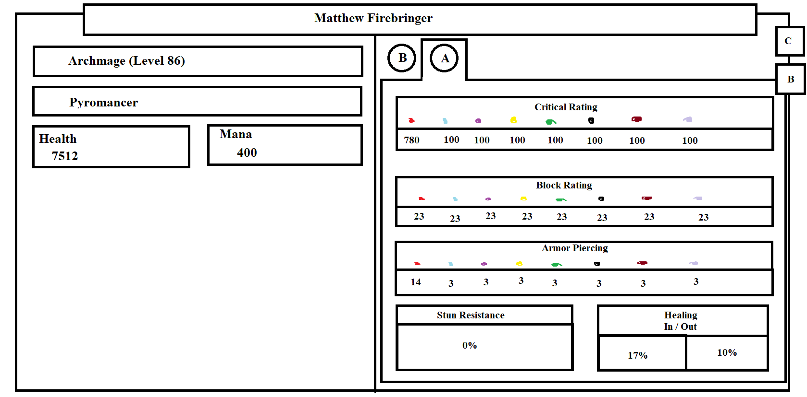
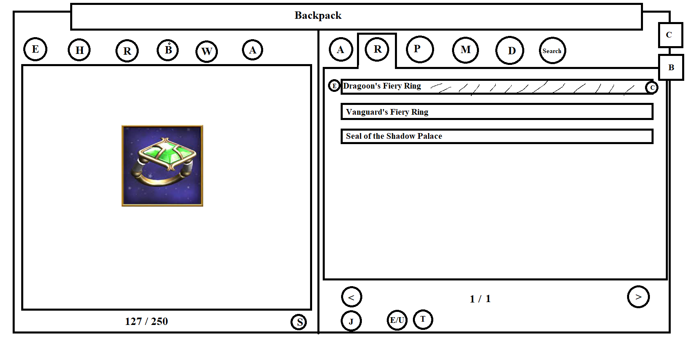
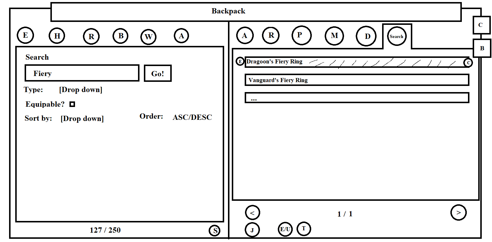
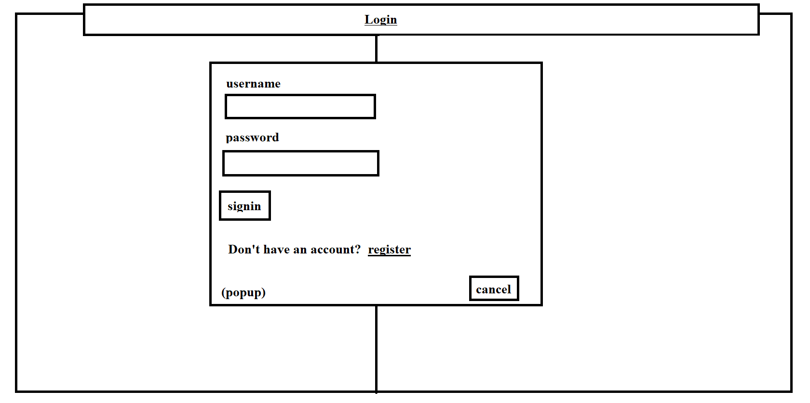
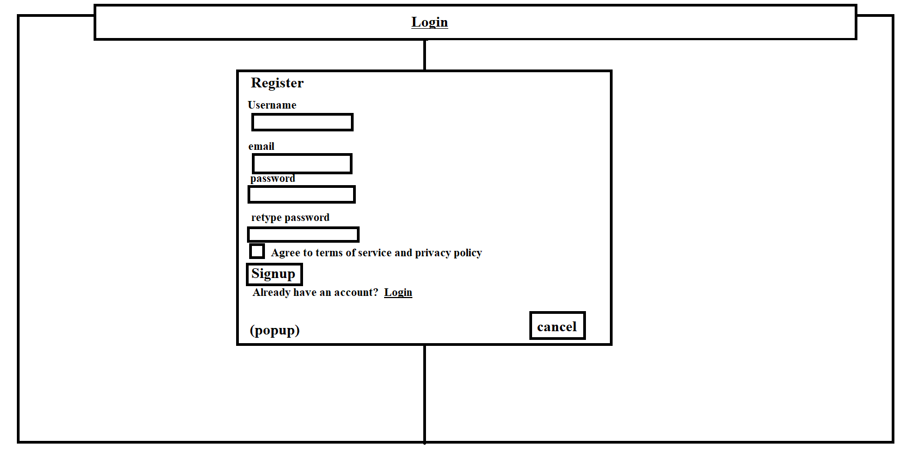

# Goals & Vision
## Business Goals
### What is the long term vision of your product?
I want the product to be useful for planners and min-maxers who like to be well prepped when playing Wizard101.
I want to provide an asset to the community I have been a part of for the past ~10 years.

### What problems are you trying to solve?
I am trying to create a tool that allows players to easily and intuitively plan their gear choices and see what their stats would be with any gear in the game.

## Business Needs
### Who are the user personas?
My users will be players of the game Wizard101. Many of them will be gamers and fairly tech savvy, while some will only know enough to use a web browser.
The biggest pain points of this app will be UI and availability, so close similarity to Wizard101's UI and 24/7 availability on the internet are required.

### How will you define success for this product?
I will define success as based on the total user accounts registered, total server requests, and total wizards created.

# Requirements
## Overview
Wizard101QuickEquip will allow users to interact with a website as if they were interacting
with their Wizard101 backpack so that they can create new gear sets and see what stats their
wizards would have.

## User Requirements
As a user, I need to create/delete one or more wizards of the school and level of my in-game wizards.

As a user, I need to see my wizard's basic and advanced statistics.

As a user, I need to equip/unequip items so I can determine the optimal gear for me.

As a user, I need to equip/shatter jewels to my items so I can determine the optimal gear for me.

As a user, I need to save my wizards so that I can take a break and continue where I left off.

As a user, I need to input my wizard's pet's bonuses so I can see my final statistics.

As a user, I need my personal data to be secure.

As a user, I need to know how I obtain each piece of gear.

As a user, I need to know what gear is good.

## Functional Requirements
The product needs to integrate with wizard101central.com to pull items and images, at their permission.
If permission is not granted, manual imports of the best gear and jewels in the game will be necessary.

## Limitations
Each user can have at most 7 wizards, as is the case in the game.

This app must be used online.

## Security
This web app will use secure (encrypted, likely https) communications.

Usernames, passwords, and emails are of high value and not to be exposed.

For more granular requirements, see the [security documentation](SECURITY.md)

# User Interface
## Mockups

Here we see the basic statistics page for the app.
Damage, resist, and accuracy are aggregated from the equipment the wizard is using.
Hovering over one of the stats provides a popup listing each piece of gear and the amount it contributes.
It has navigation to the advanced statistics as well as the backpack.

Here we see the advanced statistics page for the app.
This functions the same as the basic statistics, but with a different set of advanced statistics.
It has navigation to the basic statistics as well as the backpack.

Here we see the backpack page for the app.

Across the top is a tab for all items, a tab for each item type, and a special tab that contains a search menu for finding and filtering gear.
On the left side is an image for the currently selected item.
There is also a count of backpack capacity and a button for gear set management.
On the right are a set of pages for the type chosen listing all items of that type.
There are icons next to each item denoting whether it is equipped and if it is a crowns item.
The item will be highlighted as well if equipped.
Along the bottom are buttons for switching pages, viewing jewels for an item, equipping/unequipping an item, and trashing an item.
It has navigation to the basic statistics.

The two types of statistics are essentially tabs, while the backpack is a new "page".
This app will not have any page loads once inside, but login and logout will cause reloads.

# Milestones and Prioritization
## Milestones
* Backpack GUI built with sample data hard coded
* Basic statistics GUI built with sample data hard coded
* Advanced statistics GUI built with sample data hard coded
* Equip functionality
* Unequip functionality
* Create wizard
* Delete wizard
* Access Wizard101central.com
* Login functionality
* Save wizard functionality
* Alpha with full funcionality
* Stability, bug fixes, and UI work
* Beta
* Gear sorting (by level, by a statistic, and/or by obtainability)
* New features, like pets, farming locations, and crafting recipes

## Prioritization
### Include in MVP
* GUIs
* Equipment management
* Statistics aggregation
* Integration with wizard101central
* Logins

### Revisit
* Multiple wizards
* Pets

### Don't include in MVP
* Farming locations
* Crafting recipes

### Debate
* Jewels
* Gear sorting
* Gear sets
